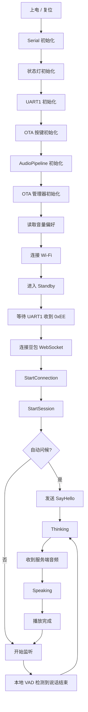

# TEST4

基于 ESP32-S3 的实时语音助手示例工程，使用 I2S 麦克风采集音频，通过 WebSocket 接入豆包实时对话服务，再将返回的 TTS 音频通过 I2S 功放/喇叭播放出来。项目同时集成了状态灯、UART1 外部触发，以及 ESP32 / STM32 双目标 OTA 能力。

这个 README 不只是说明怎么编译，也把当前代码的整体架构、硬件接线、状态流转和实现方式整理出来，方便直接放到 GitHub 仓库首页。

## 功能概览

- ESP32-S3 + Arduino + PlatformIO 工程
- I2S 麦克风采集 16 kHz 单声道 PCM
- I2S 扬声器播放 16 kHz 单声道 PCM
- 通过 TLS WebSocket 连接豆包实时语音服务
- 本地 VAD 检测说话开始/结束
- 使用 FreeRTOS 独立音频任务做采集与播放
- UART1 字节触发联网语音会话
- 板载 RGB LED 指示应用状态
- 支持 ESP32 自身 OTA 和 STM32 串口 OTA

## 硬件架构

### 核心器件

- 主控：ESP32-S3-DevKitC-1 N16R8
- 输入：I2S 数字麦克风
- 输出：I2S 功放 / DAC / 扬声器链路
- 指示：单颗 RGB NeoPixel 状态灯
- 外设通信：UART1，用于外部控制和 STM32 OTA
- 维护接口：两个 OTA 按键

### 引脚定义

以下引脚来自 `include/app_config.h`：

| 模块 | 信号 | GPIO | 说明 |
| --- | --- | ---: | --- |
| I2S 麦克风 | WS / LRCK | 41 | 输入字选择 |
| I2S 麦克风 | SD | 2 | 麦克风数据输入 |
| I2S 麦克风 | SCK / BCLK | 42 | 输入位时钟 |
| I2S 扬声器 | DIN | 6 | 音频数据输出 |
| I2S 扬声器 | BCLK | 5 | 输出位时钟 |
| I2S 扬声器 | LRC / WS | 4 | 输出字选择 |
| 功放使能 | EN | 7 | 高电平使能 |
| RGB LED | DATA | 48 | `neopixelWrite()` 控制 |
| UART1 | RX | 16 | 外部控制 / STM32 通信输入 |
| UART1 | TX | 15 | 外部控制 / STM32 通信输出 |
| ESP32 OTA 按键 | KEY | 38 | 低电平有效 |
| STM32 OTA 按键 | KEY | 47 | 低电平有效 |

### STM32 相关配置

当前代码已经为 STM32 OTA 预留了串口升级链路，但自动进入 STM32 Bootloader 的三个控制脚默认都是禁用状态：

- `STM32_BOOT0_PIN = -1`
- `STM32_BOOT1_PIN = -1`
- `STM32_NRST_PIN = -1`

这意味着：

- ESP32 可以通过 UART1 和 STM32 Bootloader 通信
- 但如果不补充 BOOT0 / BOOT1 / NRST 接线与配置，自动拉脚进入 Bootloader 的能力默认是关闭的
- 当前更像是“升级框架已完成，硬件接管方式按你的板级设计再补齐”

### 保留引脚

代码里明确把 `GPIO35 / GPIO36 / GPIO37` 视为 ESP32-S3 N16R8 内部 Flash / PSRAM 相关保留脚，OTA 按键初始化时也会主动避开这些引脚。

## 软件架构

### 模块划分

| 模块 | 文件 | 作用 |
| --- | --- | --- |
| 程序入口 | `src/main.cpp` | 只负责创建并驱动 `RealtimeVoiceApp` |
| 应用总控 | `src/realtime_voice_app.cpp` | Wi-Fi、状态机、串口触发、WebSocket 会话、OTA 协调 |
| 音频管线 | `src/audio_pipeline.cpp` | I2S 采集、VAD、播放、预缓冲、欠载补偿 |
| 协议封装 | `src/doubao_protocol.cpp` | 构造和解析豆包实时语音二进制协议帧 |
| WebSocket 客户端 | `src/doubao_ws_client.cpp` | TLS 连接、手写 WebSocket 握手、帧收发与解析 |
| OTA 管理 | `src/ota_manager.cpp` | ESP32 HTTP OTA、STM32 下载暂存与串口烧写 |
| 环形缓冲区 | `src/ring_buffer.cpp` | 线程安全音频缓冲 |
| 状态灯 | `src/status_led.cpp` | 不同状态下的灯效输出 |
| 编译期配置 | `include/app_config.h` | Wi-Fi、豆包、引脚、VAD、音频、OTA 参数 |

### 关键实现方式

#### 1. 入口极薄，所有逻辑由 `RealtimeVoiceApp` 统一编排

`main.cpp` 只做两件事：

- `setup()` 里调用 `g_app.begin()`
- `loop()` 里持续调用 `g_app.loop()`

也就是说，整个系统的真实入口其实是 `RealtimeVoiceApp`。

#### 2. 音频走独立 FreeRTOS 任务，不在 Arduino 主循环里做实时采样

`AudioPipeline` 在 `begin()` 里创建了一个固定 20 ms 周期的音频任务：

- 任务优先级：18
- 栈大小：8192
- 固定在 Core 1

这样做的目的很明确：

- 让 I2S 采集/播放更稳定
- 避免网络、JSON、串口处理阻塞音频
- 通过环形缓冲区解耦“实时音频线程”和“主循环网络线程”

#### 3. 上下行音频完全解耦

音频路径分为两条：

- 上行：麦克风 -> `tx_ring_` -> `RealtimeVoiceApp::serviceAudioUplink()` -> WebSocket
- 下行：WebSocket 音频包 -> `rx_ring_` -> 扬声器 I2S

这两个方向分别由不同缓冲区承接：

- `tx_ring_`：麦克风采集后缓存待上传音频
- `rx_ring_`：服务端返回的 TTS 音频缓存待播放数据

#### 4. 本地先做 VAD，再配合服务端事件推进状态机

本地 VAD 基于每 20 ms 音频帧的 RMS：

- 启动阈值：`900`
- 持续阈值：`550`
- 连续命中 `3` 帧判定“开始说话”
- 连续静音 `12` 帧判定“说话结束”

本地 VAD 只负责“什么时候开始采”和“什么时候转入 Thinking”。真正的会话收尾仍要等服务端 ASR / TTS 事件来完成。

#### 5. WebSocket 是手写实现，不依赖现成库

`DoubaoWsClient` 做了下面这些事情：

- 使用 `WiFiClientSecure` 建立 TLS 连接
- 手动发送 WebSocket HTTP Upgrade 请求
- 手动构造客户端掩码帧
- 手动解析服务端 WebSocket 帧
- 定时发 Ping 保活

这让协议链路更可控，但也意味着维护成本更高。

#### 6. 豆包协议也是手写打包/解包

`doubao::Protocol` 负责：

- 构造 `StartConnection`
- 构造 `StartSession`
- 构造音频上行 `TaskRequest`
- 构造 `SayHello`
- 解析服务端事件、JSON 负载和音频负载

当前会话配置中包含：

- ASR 音频格式：`pcm_s16le`, `16 kHz`, 单声道
- TTS 音频格式：`pcm_s16le`, `16 kHz`, 单声道
- bot 名称、system role、speaking style、speaker、location、model

#### 7. OTA 不是附加脚本，而是正式集成到应用状态机

OTA 相关逻辑分成两层：

- `RealtimeVoiceApp`：负责进入 OTA 模式、按键触发、manifest 解析、状态切换
- `OtaManager`：真正执行 ESP32 OTA 或 STM32 OTA

ESP32 OTA：

- 直接通过 HTTP 拉取固件流
- 可选 SHA256 校验

STM32 OTA：

- 先把固件下载到 SPIFFS 暂存
- 检查向量表是否合理
- 再经 UART Bootloader 擦写 / 写入 / 校验

## 运行逻辑

### 启动时序



### 主循环做什么

`RealtimeVoiceApp::loop()` 每次循环会依次处理：

- OTA 按键
- WebSocket 收包
- 状态灯刷新
- USB 串口命令
- UART1 外部串口输入
- 音频上行发送
- 会话状态推进
- 断线重连
- 监控日志输出

也就是说，主循环本身是一个“调度器”，不是一个阻塞式状态机。

### UART1 的业务语义

这是当前项目最关键、也最容易忽略的一点：

- 默认上电连好 Wi-Fi 后，不会立即连豆包
- 系统会停在 `Standby`
- 只有当 UART1 收到一个字节 `0xEE` 时，才会发起 API 连接

而且还有一个反向逻辑：

- 如果 API 会话已经激活
- UART1 又收到任意非 `0xEE` 数据
- 该字节会被回显到 UART1
- 同时应用会主动断开当前 API 会话

这说明当前工程显然是为“ESP32 作为语音前端、由外部 MCU 或控制器决定何时联网对话”的模式设计的。

### 语音会话状态机

主要状态如下：

| 状态 | 含义 |
| --- | --- |
| `Booting` | 启动初始化中 |
| `WifiConnecting` | 正在连接 Wi-Fi |
| `Standby` | Wi-Fi 已就绪，等待 UART1 触发 |
| `ApiConnecting` | 正在连接豆包 WebSocket |
| `SessionStarting` | 已发送 `StartSession` |
| `Listening` | 本地采集麦克风并上传 |
| `Thinking` | 用户说完，继续等待 ASR / 对话生成 |
| `Speaking` | 播放服务端返回的 TTS 音频 |
| `Ota` | 维护 / OTA 模式 |
| `Error` | 连接异常，等待重连 |

### 播放链路的细节

为了避免刚收到一小段音频就立刻开播而导致卡顿，播放侧使用了预缓冲和欠载补偿：

- 先进入 `Prebuffering`
- 到达一定缓存量后再切到 `Playing`
- 如果网络抖动导致下行音频短暂断续，会用上一个音频帧做短暂 conceal
- 之后再平滑淡入，避免突兀爆音

这套处理在嵌入式实时语音场景里是比较实用的。

## 状态灯定义

`StatusLed` 使用 GPIO48 的 NeoPixel 指示状态：

| 状态 | 灯效 |
| --- | --- |
| Booting | 白色呼吸 |
| WifiConnecting | 蓝绿色呼吸 |
| Standby | 绿色脉冲 |
| ApiConnecting / SessionStarting | 青绿色呼吸 |
| Listening | 绿色系脉冲 |
| Thinking | 橙色呼吸 |
| Speaking | 品红常亮 |
| Ota | 蓝色常亮 |
| Error | 红色闪烁 |

## OTA 机制

### 进入方式

有两种方式：

- 按下 ESP32 OTA 按键或 STM32 OTA 按键
- 通过 USB 串口输入 `ota ...` 命令

### OTA 行为

进入 OTA 模式后，系统会：

1. 停止当前语音会话
2. 确保 Wi-Fi 在线
3. 在 5 秒窗口内尝试读取 manifest
4. 比较已安装版本和最新版本
5. 如需升级，则执行目标设备升级
6. 结束后重启 ESP32

### manifest / 直链回退

代码支持两种 OTA 描述方式：

- manifest JSON
- 直接固件 URL

逻辑是：

- 优先读取 manifest
- 如果 manifest 不可用，再退回默认固件 URL

### 当前默认 OTA 配置

默认配置位于 `include/app_config.h`，包括：

- OTA 服务器基地址
- ESP32 manifest URL
- STM32 manifest URL
- 当前版本号
- fallback 固件 URL

## 串口命令

USB 串口支持的命令包括：

```text
help
vol
vol 80
vol +
vol -
mute
ota status
ota target esp
ota target stm
ota start [url] [sha256] [version]
ota exit
```

## 构建与烧录

### 开发环境

- [PlatformIO](https://platformio.org/)
- Arduino framework
- 板卡：`esp32-s3-devkitc-1-n16r8`
- Flash：16 MB
- PSRAM：8 MB

### 依赖

`platformio.ini` 中显式声明的依赖只有一个：

- `bblanchon/ArduinoJson`

其余能力主要依赖 ESP32 Arduino Core 自带组件。

### 编译

```bash
pio run
```

### 烧录

```bash
pio run -t upload
```

### 串口监视

```bash
pio device monitor -b 115200
```

## 配置说明

绝大多数配置集中在 `include/app_config.h`：

- Wi-Fi 账号密码
- 豆包 AppId / AccessKey / AppKey
- 音频采样率、帧长、VAD 参数
- 麦克风与扬声器引脚
- UART1 引脚与触发字节
- OTA 地址、版本、超时、按键
- 音量范围、默认值

### 公开仓库前必须注意

当前代码把以下敏感信息直接写在源码配置里：

- Wi-Fi SSID / Password
- 豆包 AppId / AccessKey
- WebSocket AppKey

如果准备公开到 GitHub，强烈建议先改成下面任一方案：

- 用 `build_flags` 从本地 `platformio.ini` 私有覆盖
- 用单独的、不纳入版本控制的本地配置头文件
- 用 CI/CD 注入编译宏

例如：

```ini
build_flags =
    -DCORE_DEBUG_LEVEL=3
    -std=gnu++17
    -DWIFI_SSID=\"your-ssid\"
    -DWIFI_PASSWORD=\"your-password\"
    -DDOUBAO_APP_ID=\"your-app-id\"
    -DDOUBAO_ACCESS_KEY=\"your-access-key\"
```

## 当前实现的几个注意点

### 1. TLS 证书校验目前被关闭

`DoubaoWsClient` 里使用了：

```cpp
client_.setInsecure();
```

这意味着：

- TLS 仍然加密
- 但不会校验证书链
- 对正式量产设备来说，安全性是不够的

### 2. 语音链路是半双工风格

实现上更接近：

- 监听用户
- 结束后等待识别/生成
- 收到 TTS 后停止采集并播放
- 播放完成再回到监听

它不是一个“边说边打断边混音”的全双工方案。

### 3. 音量允许超过 100%

当前音量范围是 `0% ~ 200%`，默认 `60%`。代码里也明确提醒：

- 超过 100% 可能引入削波失真

### 4. 项目对 PSRAM 有明显依赖

大块音频缓冲、WebSocket 负载缓冲和部分协议包都优先分配在 PSRAM 中，所以目标板必须和工程配置一致，最好使用 N16R8 这一档资源配置。

## 仓库结构

```text
TEST4/
├─ boards/
│  └─ esp32-s3-devkitc-1-n16r8.json
├─ include/
│  ├─ app_config.h
│  ├─ audio_pipeline.h
│  ├─ doubao_protocol.h
│  ├─ doubao_ws_client.h
│  ├─ logger.h
│  ├─ ota_manager.h
│  ├─ realtime_voice_app.h
│  ├─ ring_buffer.h
│  └─ status_led.h
├─ src/
│  ├─ audio_pipeline.cpp
│  ├─ doubao_protocol.cpp
│  ├─ doubao_ws_client.cpp
│  ├─ main.cpp
│  ├─ ota_manager.cpp
│  ├─ realtime_voice_app.cpp
│  ├─ ring_buffer.cpp
│  └─ status_led.cpp
└─ platformio.ini
```

## 适合什么场景

这个工程比较适合作为以下项目的基础版本：

- 带本地麦克风和喇叭的中文语音助手终端
- ESP32 作为语音前端、STM32 作为主控的双 MCU 方案
- 需要“串口触发联网对话”的机器人或陪伴设备
- 需要同时管理 ESP32 自身 OTA 和下位机 OTA 的整机项目

## 后续可优化方向

- 把敏感配置从源码中彻底移出
- 给 WebSocket 增加证书校验或证书绑定
- 把 OTA 配置抽离成独立配置文件或 NVS 参数
- 为 UART1 触发协议补充更明确的命令格式，而不只是单字节触发
- 为状态机和协议收发补单元测试 / 集成测试
- 如需更自然的人机对话，可继续演进成可打断的全双工音频链路

## 总结

从实现方式上看，TEST4 不是一个“演示性质的单文件样例”，而是一个已经按产品化思路拆分过模块的嵌入式实时语音前端：

- 应用控制、音频线程、协议层、网络层、OTA 层彼此解耦
- 硬件接线清晰，板级资源冲突也有显式检查
- 运行逻辑围绕“UART1 触发语音会话”这一业务假设展开
- 已具备继续演进成完整整机固件的基础

如果你准备把它继续开源，最先该处理的不是功能，而是配置安全和部署文档，这份 README 正好可以作为第一版仓库首页说明。
